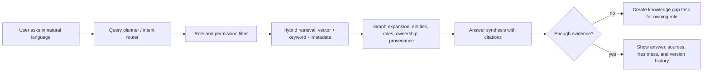
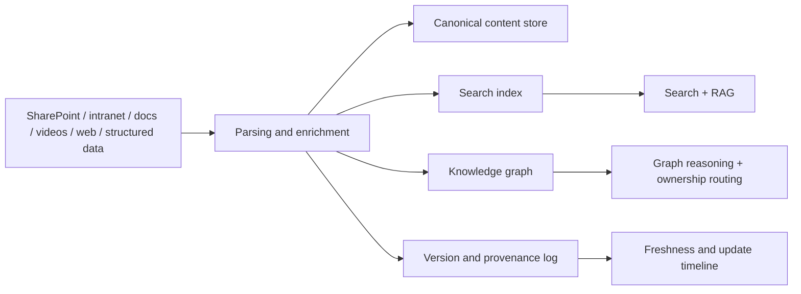

# group_idea_research

Research memo for the SIX "Company Brain" prototype.

This file combines:
- the ideas already discussed by the group,
- new ideas that came out of the research sweep,
- and primary-source findings that matter for the ideal implementation.

The repo README says the data is heterogeneous, noisy, and sometimes mislabeled, so the implementation should verify the actual content of every source instead of trusting filenames or extensions.

## 1. Original ideas from the group

- Natural-language input should search the database directly.
- The system should ingest text, intranet content, videos, and any other relevant source.
- The knowledge base should stay dynamic, not static, and it should show when information changed.
- Access should depend on the employee's role, not the individual person.
- Data should be linked back to the role that provided it.
- The base should scale and expand.
- If a query exposes a knowledge gap, the system should find the responsible role and help fill that gap.

## 2. Short answer: RAG, GraphRAG, or both?

Use both, but not as two equal copies of the same thing.

- Use classic RAG as the default retrieval layer for direct lookup, citations, and fast question answering.
- Add a graph layer for ownership, relationships, provenance, versioning, and cross-document reasoning.
- Use GraphRAG when the question needs entity relationships, multi-hop reasoning, whole-corpus themes, or gap detection.
- Use a search planner or agentic retrieval layer to decide whether the question should hit plain hybrid search, graph traversal, or both.

My recommendation is:

1. Start with hybrid search + permission filtering + citations.
2. Add a knowledge graph for roles, entities, document ownership, and provenance.
3. Use GraphRAG-style global search only where it clearly adds value.

Reason: Microsoft's GraphRAG docs show that local search is strong for entity-specific questions, while global search is better for whole-dataset reasoning. They also note that indexing is expensive and prompt tuning matters, so GraphRAG should be used where the graph really pays for itself.

## 3. Suggested architecture

## 4. Research findings by topic

### 4.1 Retrieval architecture

What the research says:
- Standard RAG is good for direct retrieval and grounded answers.
- GraphRAG is better when the answer depends on relationships, communities, or themes across many documents.
- GraphRAG local search combines raw chunks with AI-extracted knowledge-graph data.
- GraphRAG global search uses community reports and a map-reduce style flow to reason over the whole corpus.
- GraphRAG's docs explicitly say baseline RAG struggles with aggregate questions such as "what are the top themes" across a dataset.
- FastGraphRAG is mentioned as a lower-cost option for summary-heavy workloads.

What this means for us:
- Do not choose "RAG or GraphRAG" as a binary.
- Use RAG for fast lookup and citations.
- Use a graph layer for structure and ownership.
- Use GraphRAG selectively for global reasoning, gap analysis, and relationship-heavy queries.

Primary sources:
- [GraphRAG repository](https://github.com/microsoft/graphrag)
- [GraphRAG query overview](https://microsoft.github.io/graphrag/query/overview/)
- [GraphRAG global search](https://microsoft.github.io/graphrag/query/global_search/)
- [GraphRAG dataflow and provenance](https://microsoft.github.io/graphrag/index/default_dataflow/)
- [GraphRAG methods](https://microsoft.github.io/graphrag/index/methods/)

### 4.2 Natural-language search over the database

What the research says:
- Azure AI Search agentic retrieval can decompose complex questions into subqueries, run them against knowledge sources, and return either raw grounding chunks or synthesized answers.
- Microsoft Search parses user intent and supports search across files, people, sites, and answers.
- Microsoft Graph search plus Copilot connectors can expose external content from SaaS systems and internal systems in the Microsoft ecosystem.
- Elastic, Weaviate, Qdrant, Pinecone, and OpenSearch all support some mix of semantic search, lexical search, hybrid search, filters, and reranking.

What this means for us:
- The user-facing experience should feel like a search assistant, not a chat toy.
- The backend should support query planning, not just vector similarity.
- We should combine vector search, keyword search, metadata filters, and a graph traversal step when needed.

Primary sources:
- [Azure AI Search agentic retrieval overview](https://learn.microsoft.com/en-us/azure/search/search-agentic-retrieval-concept)
- [Azure AI Search quickstart for agentic retrieval](https://learn.microsoft.com/en-us/azure/search/search-get-started-agentic-retrieval)
- [Microsoft Search overview](https://learn.microsoft.com/en-US/microsoftsearch/overview-microsoft-search)
- [Microsoft Graph search overview](https://learn.microsoft.com/en-us/graph/search-concept-overview)
- [Elastic RAG docs](https://www.elastic.co/docs/solutions/search/rag)
- [Weaviate hybrid search](https://docs.weaviate.io/weaviate/search/hybrid)
- [Qdrant hybrid search](https://qdrant.tech/documentation/search/hybrid/)
- [Pinecone hybrid search](https://docs.pinecone.io/guides/search/hybrid-search)
- [OpenSearch hybrid query](https://docs.opensearch.org/2.13/query-dsl/compound/hybrid/)

### 4.3 Ingesting text, intranet content, and videos

What the research says:
- Azure AI Search SharePoint indexers can extract text, images, metadata, ACLs, and sensitivity labels from SharePoint libraries, and they support incremental indexing and delete detection.
- Microsoft 365 Copilot connectors can ingest external content such as Confluence, Jira, Salesforce, Google services, MediaWiki, Box, and more into Microsoft Graph search experiences.
- Azure AI Video Indexer can extract transcription, OCR, scenes, people, and other insights from videos and audio.
- Azure Speech-to-Text can handle fast transcription and batch transcription for audio or video.
- Neo4j's LLM graph builder can transform PDFs, docs, text, YouTube videos, and web pages into a structured knowledge graph.
- Weaviate, Qdrant, Pinecone, and OpenSearch all have multimodal search options that go beyond plain text.

What this means for us:
- "Embed everything" should not mean "convert everything into one giant text blob".
- Every source type needs its own preprocessing path:
  - documents -> text extraction + chunking,
  - intranet pages -> crawl + metadata capture,
  - videos -> transcription + OCR + scene/keyframe captions,
  - images -> OCR + captioning + image embeddings if needed,
  - structured tables -> row/field normalization,
  - audio -> transcription and speaker-aware metadata if relevant.
- Keep the raw source, the derived text, and the provenance links together.

Primary sources:
- [SharePoint in Microsoft 365 indexer](https://learn.microsoft.com/en-us/azure/search/search-how-to-index-sharepoint-online)
- [SharePoint ACL ingestion in Azure AI Search](https://learn.microsoft.com/azure/search/search-indexer-sharepoint-access-control-lists)
- [Azure AI Search indexer overview](https://learn.microsoft.com/en-us/azure/search/search-indexer-overview)
- [Azure AI Video Indexer docs](https://learn.microsoft.com/en-us/azure/azure-video-indexer/)
- [Azure Speech to text REST API](https://learn.microsoft.com/en-us/azure/ai-services/speech-service/rest-speech-to-text)
- [Neo4j LLM graph builder](https://github.com/neo4j-labs/llm-graph-builder)
- [Weaviate multimedia search](https://docs.weaviate.io/weaviate/search/near-media)
- [Qdrant multimodal and multilingual RAG](https://qdrant.tech/documentation/multimodal-search/)
- [Pinecone multimodal assistants](https://docs.pinecone.io/guides/assistant/multimodal)
- [OpenSearch document search](https://opensearch.org/platform/document-search/)

### 4.4 Role-based access, not person-based access

What the research says:
- Azure AI Search supports document-level access control, security filters, ACL/RBAC scopes, and Purview sensitivity labels.
- SharePoint indexers can preserve permission metadata and enforce it at query time.
- Elastic supports document-level security and field-level security.
- TigerGraph supports role-based access control and even exposes RBAC in its GraphRAG product.

What this means for us:
- Access control should be attached to persistent roles and role groups, not to individual employees.
- Employees can change, but the role entities stay stable.
- The search index should store role/group identifiers as filterable metadata.
- The graph should link each document or chunk to one or more source roles.
- Query-time authorization should happen before answer synthesis, not after.

Suggested role schema:

| Field | Purpose |
| --- | --- |
| `role_id` | Stable identifier for the role |
| `role_name` | Human-readable role name |
| `role_group_ids` | Permission groups used at query time |
| `responsibility_tags` | Topics or domains owned by the role |
| `source_role_id` | Which role authored or approved the content |
| `source_system` | Where the content came from |
| `valid_from` / `valid_to` | Optional temporal scope |

Primary sources:
- [Azure AI Search document-level access control](https://learn.microsoft.com/en-us/azure/search/search-document-level-access-overview)
- [Azure AI Search security best practices](https://learn.microsoft.com/en-us/azure/search/search-security-best-practices)
- [Azure AI Search SharePoint ACL ingestion](https://learn.microsoft.com/azure/search/search-indexer-sharepoint-access-control-lists)
- [Elastic document and field access control](https://www.elastic.co/guide/en/elasticsearch/reference/current/field-and-document-access-control.html)
- [TigerGraph RBAC access control model](https://docs.tigergraph.com/tigergraph-server/4.1/user-access/access-control-model)
- [TigerGraph access management](https://docs.tigergraph.com/tigergraph-server/4.1/user-access/)

### 4.5 Freshness, update visibility, and "how did this change?"

What the research says:
- Azure AI Search indexers can run on schedules, track execution history, and expose start/end times, errors, and counts.
- Incremental indexing is based on high-water marks so only new and updated content is reprocessed.
- SharePoint and Microsoft Graph expose version history for files.
- Graphiti is built for temporal context graphs, provenance, incremental updates, and historical queries without full recomputation.
- OriginTrail DKG emphasizes auditable lifecycle records and verifiable knowledge assets.

What this means for us:
- Every answer should know not only "what is the source" but also "when was it last seen" and "which version was used".
- The UI should show a freshness badge and a change timeline for the topic or document.
- For each content item, store at least:
  - source last modified time,
  - last indexed time,
  - version number or version id,
  - content hash,
  - extraction status,
  - ACL snapshot,
  - provenance reference.
- A good update view should answer:
  - what changed,
  - when it changed,
  - who/what system changed it,
  - what answers depend on it.

Primary sources:
- [Azure AI Search monitor indexers](https://learn.microsoft.com/en-us/azure/search/search-monitor-indexers)
- [Azure AI Search run or reset indexers](https://learn.microsoft.com/en-us/azure/search/search-howto-run-reset-indexers)
- [Azure AI Search indexer overview](https://learn.microsoft.com/en-us/azure/search/search-indexer-overview)
- [Microsoft Graph driveItem versions](https://learn.microsoft.com/en-us/graph/api/driveitem-list-versions?view=graph-rest-beta)
- [Graphiti repository](https://github.com/getzep/graphiti)
- [OriginTrail DKG repository](https://github.com/OriginTrail/dkg-v9)

### 4.6 Knowledge gap detection and routing to the right role

What the research says:
- There is established work on selective question answering, abstention, and knowledge-gap-aware QA.
- CRAG, ARES, and open-rag-eval are focused on evaluating answer quality and refusing or flagging risky answers.
- Papers on knowledge-gap guided QA show that "missing knowledge" can be used as a first-class signal rather than pretending the answer exists.
- Graph-guided routing is an active research area, including knowledge-graph-guided LLM routers.

What this means for us:
- If the system cannot find enough grounded evidence, it should not hallucinate.
- It should:
  - abstain or mark the answer as incomplete,
  - identify the missing topic,
  - infer the most likely owning role,
  - create a gap item for follow-up,
  - attach the evidence that was searched already.
- Over time, gap items become a backlog for knowledge curation.

Suggested gap workflow:
1. User asks a question.
2. Retrieval runs with ACL and role filters.
3. If evidence is thin, conflicting, or stale, mark the topic as a gap.
4. Use the graph to find the owning role or the nearest responsible role.
5. Create a task that asks for the missing evidence, decision, or update.
6. Feed the new knowledge back into the pipeline and re-index it.

Primary sources:
- [open-rag-eval](https://github.com/vectara/open-rag-eval)
- [ARES](https://github.com/stanford-futuredata/ARES)
- [CRAG](https://github.com/facebookresearch/CRAG)
- [What's Missing: A Knowledge Gap Guided Approach for Multi-hop Question Answering](https://arxiv.org/abs/1909.09253)
- [Selective Question Answering under Domain Shift](https://arxiv.org/abs/2006.09462)
- [Knowledge Graph RAG: Agentic Crawling and Graph Construction in Enterprise Documents](https://arxiv.org/abs/2604.14220)
- [AgentRouter](https://arxiv.org/abs/2510.05445)

## 5. Similar implementations worth studying

| Project / product | Why it matters |
| --- | --- |
| [GraphRAG](https://github.com/microsoft/graphrag) | The clearest public reference for graph-based RAG with local and global search. |
| [Azure AI Search agentic retrieval](https://learn.microsoft.com/en-us/azure/search/search-agentic-retrieval-concept) | Good model for natural-language query planning, source-backed answers, and retrieval orchestration. |
| [Microsoft Search](https://learn.microsoft.com/en-US/microsoftsearch/overview-microsoft-search) | Shows how natural-language enterprise search and relevance can work in a productivity context. |
| [Microsoft 365 Copilot connectors](https://learn.microsoft.com/en-us/graph/connecting-external-content-connectors-overview) | Strong pattern for bringing external SaaS and intranet content into a common search fabric. |
| [Neo4j GraphRAG package](https://github.com/neo4j/neo4j-graphrag-python) | Useful for graph traversal, hybrid retrieval, and knowledge graph-backed Q&A. |
| [Neo4j LLM graph builder](https://github.com/neo4j-labs/llm-graph-builder) | Demonstrates document-to-graph pipelines including web and YouTube sources. |
| [Graphiti](https://github.com/getzep/graphiti) | Best fit for temporal knowledge, provenance, and historical queries. |
| [TigerGraph GraphRAG](https://github.com/tigergraph/graphrag) | Interesting because it combines RBAC, multimodal ingestion, and GraphRAG in one productized demo. |
| [OriginTrail DKG](https://github.com/OriginTrail/dkg-v9) | Strong reference for auditable lifecycle records and verifiable knowledge assets. |
| [Elastic RAG](https://www.elastic.co/docs/solutions/search/rag) | Demonstrates security-aware RAG with robust retrieval primitives. |
| [Weaviate](https://docs.weaviate.io/weaviate/) | Good reference for hybrid, filterable, and multimodal search. |
| [Qdrant](https://qdrant.tech/) | Good reference for multimodal retrieval, payload filters, and high-performance vector search. |
| [OpenSearch document search](https://opensearch.org/platform/document-search/) | Good open-source search platform reference for multimodal and hybrid document search. |

## 6. Recommended implementation shape for this prototype

### Layer 1: ingestion
- Build source adapters for SharePoint, intranet pages, file shares, video, audio, and any structured data source.
- Detect the real file type from content, not from extension.
- Store raw source, parsed text, extracted metadata, and provenance.

### Layer 2: retrieval
- Use hybrid search: keyword + vector + metadata filters.
- Enforce role-based permissions before answer synthesis.
- Preserve citations and source snippets.

### Layer 3: knowledge graph
- Model roles, ownership, entities, topics, and source relationships.
- Store provenance and temporal validity.
- Use graph traversal for cross-document reasoning and ownership routing.

### Layer 4: freshness and change history
- Record source modification time, indexing time, version id, and content hash.
- Show a change timeline in the UI.
- Flag stale content and stale answers.

### Layer 5: gap workflow
- Turn unanswered or weakly answered questions into gap items.
- Route them to the responsible role.
- Re-ingest the fix when the role provides new evidence.

## 7. Further ideas I would add

- A topic coverage map per role.
- A freshness score that combines source age, index age, and confidence.
- A "why am I seeing this?" permission explanation for every answer.
- A "what changed?" diff view for updated documents and answer sources.
- Automatic detection of duplicate, stale, or conflicting sources.
- A curation queue for missing topics, grouped by role and severity.
- A feedback loop where users can mark answers as stale, incomplete, or wrong.
- An evaluation set of representative company questions to measure retrieval quality over time.
- A source-trust score that separates official policy, approved guidance, and unverified material.
- A small "decision log" attached to answers that explains why a source was selected.

## 8. Winning pitch angle

The strongest pitch is not "we built a smarter wiki." It is:

"We built the operating system for institutional memory."

That line matters because it changes the product from passive search to active memory governance. The system does not just answer questions. It:

- remembers what the organization knows,
- shows who owns it,
- proves why an answer is trustworthy,
- tells you when it changed,
- and routes what it does not know back to the right role.

### The three pitch pillars

1. Find
- Natural-language search across docs, intranet, video, and structured sources.
- Permission-aware hybrid retrieval.
- Role-aware ranking so answers are relevant to the employee's job, not just their words.

2. Trust
- Verified and deprecated knowledge states, inspired by Glean's verification flow.
- Freshness badges and update timelines.
- Source lineage, version history, and "why am I seeing this?" explanations.

3. Act
- Expert or role routing when evidence is thin.
- One-click gap creation when the answer is incomplete.
- Handover packs, topic owners, and follow-up workflows.

### Outside-the-box features that would stand out in a demo

- Role cards instead of just people cards.
  - Search "who owns this?" and the system shows the responsible role, current owner, related docs, and open gaps.
- Living answer cards.
  - Answers can be verified, deprecated, or scheduled for review, like a controlled knowledge asset instead of a static chat reply.
- Policy impact radar.
  - Ask "what changes if this regulation updates?" and the system shows affected products, teams, and source documents.
- Handover mode.
  - If someone changes role or leaves, the system can generate an auto-handover brief from their contributions, unresolved questions, and recent decisions.
- Knowledge coverage heatmap.
  - Show which roles and topics are covered, stale, or missing.
- Contradiction detection.
  - If two sources disagree, the system surfaces the conflict instead of hiding it.
- Living topic pages.
  - Search a topic and get a continuously updated page with the best answer, owning role, related sources, change timeline, and open gaps.
- Trusted answer bookmarks.
  - Promote canonical answers the way Microsoft Search promotes bookmarks and Glean supports verified content.

### Best demo narrative

1. Start with a hard question from the challenge domain.
2. The system returns a grounded answer with citations, freshness, and role ownership.
3. Show the answer is only visible because the user has the right role permissions.
4. Open the provenance view and show exactly which source and version was used.
5. Show that one source is stale or incomplete.
6. Click "create knowledge gap" and assign it to the owning role.
7. End with the pitch: the system doesn't just answer today, it makes tomorrow's answers better.

### Comparable product signals

These products show that the market already understands parts of the concept:

- [Glean](https://www.glean.com/product/ai-search) emphasizes unified search, real-time permissions, knowledge graph personalization, and expert search.
- [Glean Expert Search](https://docs.glean.com/agents/actions/glean/expert-search) explicitly ranks internal subject matter experts from authorship, ticket assignments, and other contributions.
- [Glean verification](https://docs.glean.com/archive/help-glean/verifying-documents/how-verification-works) shows verified, unverified, and deprecated states, which is exactly the kind of freshness trust layer this project needs.
- [Atlassian Rovo Search](https://support.atlassian.com/rovo/docs/search/) shows knowledge cards, answers, bookmarks, and third-party connectors in a natural-language search experience.
- [Atlassian Rovo connectors](https://www.atlassian.com/software/rovo/guides/admin-guide/rovo-connectors) reinforce permission-aware cross-app search.
- [Atlassian Rovo Ops agent](https://support.atlassian.com/rovo/docs/using-ops-guide/) shows how historical incidents, runbooks, and post-mortems can be turned into a queryable operational memory layer.
- [Microsoft Search bookmarks](https://learn.microsoft.com/en-us/microsoftsearch/manage-bookmarks) show how curated answers can be published, scheduled, and managed like a product.
- [Microsoft Search overview](https://learn.microsoft.com/en-US/microsoftsearch/overview-microsoft-search) shows the standard enterprise expectation: people, files, sites, org charts, and answers in one search experience.

## 9. Practical conclusion

The ideal implementation is not a pure vector database, and not a pure knowledge graph.

It is:

- hybrid search for fast natural-language lookup,
- graph structure for ownership, relationships, and provenance,
- multimodal ingestion for videos and other non-text sources,
- document-level permissions based on role groups,
- temporal metadata for freshness and version history,
- and a gap workflow that routes missing knowledge back to the responsible role.

That combination fits the challenge better than a single-component "wiki chatbot" because it preserves evidence, access control, and future growth.

## 10. Adjacent patterns and domain standards

The first research pass was strong on retrieval and access control, but it was not yet broad enough for a winning pitch. These adjacent systems and standards close the gap.

### 10.1 Software catalog and ownership graph patterns

Backstage is a strong model for ownership-aware systems:

- [Backstage Software Catalog](https://backstage.io/docs/features/software-catalog/)
- [Viewing what you own](https://backstage.io/docs/getting-started/view-what-you-own)
- [Viewing entity relationships](https://backstage.io/docs/getting-started/viewing-entity-relationships)
- [The life of an entity](https://backstage.io/docs/features/software-catalog/life-of-an-entity/)
- [Entity references](https://backstage.io/docs/features/software-catalog/references/)

Why it matters:
- The catalog model is not just "find stuff."
- It is "what exists, who owns it, how does it relate, and what is its lifecycle?"
- That is exactly the mental model we need for role-owned knowledge pages and handover flows.

### 10.2 Data catalog, governance, and freshness patterns

OpenMetadata and DataHub show what mature knowledge governance looks like:

- [OpenMetadata data assets overview](https://docs.open-metadata.org/latest/how-to-guides/guide-for-data-users/data-asset-tabs)
- [OpenMetadata lineage view](https://docs.open-metadata.org/how-to-guides/data-lineage/explore)
- [OpenMetadata follow asset](https://docs.open-metadata.org/latest/how-to-guides/guide-for-data-users/follow-data-asset)
- [OpenMetadata announcements](https://docs.open-metadata.org/latest/how-to-guides/guide-for-data-users/announcements)
- [OpenMetadata glossary term version history](https://docs.open-metadata.org/v1.2.x/how-to-guides/data-governance/glossary/glossary-term)
- [OpenMetadata data quality](https://docs.open-metadata.org/latest/how-to-guides/data-quality-observability/quality)
- [OpenMetadata ownership](https://docs.open-metadata.org/how-to-guides/guide-for-data-users/data-ownership)
- [DataHub overview](https://docs.datahub.com/)

Why it matters:
- The right analogy for this project is not only "search."
- It is also "catalog," "ownership," "lineage," "quality," "deprecation," and "notifications."
- OpenMetadata's follow/announcement pattern is especially useful for surfacing updates to people who care about a topic.

### 10.3 Provenance standards

If we want answer traceability that can survive product evolution, we should borrow standards instead of inventing our own vocabulary:

- [W3C PROV-O](https://www.w3.org/TR/prov-o/)
- [W3C PROV namespace](https://www.w3.org/ns/prov/)
- [OpenLineage](https://openlineage.io/)

Why it matters:
- PROV gives the basic language of entity, activity, and agent.
- OpenLineage gives a practical lineages-for-runs model.
- Together they provide a strong foundation for answer lineage, update history, and provenance graphs.

### 10.4 Meeting memory and expertise inference

If the system is supposed to capture tacit knowledge, meetings and work activity are not optional sources:

- [Teams meeting transcripts and recordings via Microsoft Graph](https://learn.microsoft.com/microsoftteams/platform/graph-api/meeting-transcripts/overview-transcripts?view=graph-rest-1.0)
- [Microsoft Graph meeting transcripts](https://learn.microsoft.com/en-us/graph/api/onlinemeeting-list-transcripts?view=graph-rest-1.0)
- [Microsoft Graph meeting insights](https://learn.microsoft.com/en-us/microsoftteams/platform/graph-api/meeting-transcripts/meeting-insights)
- [People Skills AI inferencing](https://learn.microsoft.com/en-us/microsoft-365/copilot/people-skills-ai-inferencing)
- [Microsoft Graph people API](https://learn.microsoft.com/en-us/graph/people-insights-overview)
- [Glean Expert Search](https://docs.glean.com/agents/actions/glean/expert-search)

Why it matters:
- A lot of institutional knowledge is created in meetings, not documents.
- Expert routing should use activity, not just org charts.
- People Skills and Glean show the direction: skills and experts inferred from real work signals.

### 10.5 Managed answers and curation workflows

The best enterprise systems do not leave all content as raw search results. They curate:

- [Microsoft Search bookmarks](https://learn.microsoft.com/en-us/microsoftsearch/manage-bookmarks)
- [Microsoft Search acronyms](https://learn.microsoft.com/en-us/microsoftsearch/manage-acronyms)
- [Microsoft Search Q&A](https://learn.microsoft.com/en-us/answers/support/search)
- [Atlassian Rovo bookmarks](https://support.atlassian.com/rovo/docs/bookmarks/)
- [Atlassian Rovo definitions and knowledge cards](https://support.atlassian.com/rovo/docs/explore-rovo-features/)
- [Atlassian Rovo deep research](https://support.atlassian.com/rovo/docs/using-rovo-deep-research/)
- [Glean verification](https://docs.glean.com/archive/help-glean/verifying-documents/how-verification-works)

Why it matters:
- A winning pitch needs managed, canonical answers, not just retrieval.
- Verification, deprecation, bookmarks, and definitions are the building blocks of a living knowledge base.

### 10.6 Evaluation and red-teaming infrastructure

For a credible pitch, we should show how answer quality will be measured continuously:

- [TruLens](https://github.com/truera/trulens)
- [DeepEval](https://github.com/confident-ai/deepeval)
- [Promptfoo](https://github.com/promptfoo/promptfoo)
- [RAGAS](https://github.com/explodinggradients/ragas)
- [Open RAG Eval](https://github.com/vectara/open-rag-eval)

Why it matters:
- This is how we keep the system honest after the demo.
- We can measure grounding, faithfulness, refusal quality, and regressions over time.

### 10.7 Financial-domain standards that make this feel native to SIX

This is the biggest gap in the first pass, and the most important one for a SIX-adjacent pitch:

- [GLEIF LEI](https://www.gleif.org/en/organizational-identity/lei-vlei/the-legal-entity-identifier-lei/)
- [GLEIF vLEI](https://www.gleif.org/en/organizational-identity/introducing-the-verifiable-lei-vlei)
- [GLEIF LEI reference data](https://www.gleif.org/en/lei-data/access-and-use-lei-data/level-1-data-lei-cdf-3-1-format)
- [FIBO](https://spec.edmcouncil.org/fibo/index.html)
- [FIBO GitHub repository](https://github.com/edmcouncil/fibo)
- [XBRL taxonomies](https://www.xbrl.org/the-standard/what/key-concepts-in-xbrl/taxonomies/)

Why it matters:
- LEI / vLEI directly connect entity identity, personal identity, and official organizational role.
- That is a very close match to the project's requirement that roles persist even when people leave.
- FIBO is designed to give meaning to financial instruments, business entities, and processes across the financial industry.
- XBRL taxonomies are a good analogy for structured regulatory reporting language and controlled business semantics.

### 10.8 What this changes in the pitch

These additional systems and standards push the product story from "enterprise RAG" to "governed memory infrastructure for a regulated financial organization."

That means the pitch can credibly claim:

- ownership-aware knowledge,
- role-attested access and routing,
- provenance and versioning,
- meeting memory and tacit knowledge capture,
- canonical answer management,
- continuous evaluation,
- and financial-domain semantic structure, not just generic embeddings.

## 11. Extra research pass: gaps that still matter

The memo is now broad enough to cover the main architecture, governance, and pitch patterns. This final pass fills in the remaining pieces that make the system feel complete rather than merely search-like.

### 11.1 Document intelligence for noisy, mixed-format source packs

The project corpus is heterogeneous and partly mislabeled, so raw text extraction is not enough:

- [Azure AI Document Intelligence layout](https://learn.microsoft.com/en-us/azure/ai-services/document-intelligence/concept-layout?view=doc-intel-3.0.0&viewFallbackFrom=form-recog-3.0.0)
- [Azure AI OCR](https://learn.microsoft.com/en-us/azure/ai-services/computer-vision/overview-ocr)

Why it matters:
- Layout models extract text, tables, headings, figures, and structure, which is essential for PDFs, scans, and Office files.
- OCR is the fallback for images and scanned material.
- For this project, document structure should be treated as first-class ingestion data, not just a preprocessing detail.

### 11.2 Temporal memory and evolving truth

For a knowledge base that changes over time, the strongest reference remains:

- [Graphiti](https://github.com/getzep/graphiti)

Why it matters:
- Graphiti is built around temporal context graphs, incremental updates, and provenance.
- It is a good model for "what is true now" versus "what was true last quarter."
- That is a better fit than a static index for role-owned, frequently changing institutional knowledge.

### 11.3 Additional market comparables

The broader market validates the idea that this should be a unified work-memory layer, not just a chatbot:

- [Dropbox Dash](https://help.dropbox.com/view-edit/dropbox-ai-overview)
- [Dropbox Dash supported content](https://help.dropbox.com/organize/dash-supported-content-types)
- [Vertex AI Search](https://docs.cloud.google.com/generative-ai-app-builder/docs/enterprise-search-introduction)
- [Vertex AI Search access control with IAM](https://docs.cloud.google.com/generative-ai-app-builder/docs/access-control)
- [ServiceNow AI Search](https://www.servicenow.com/content/dam/servicenow-assets/public/ja-jp/doc-type/resource-center/data-sheet/ds-ai-search.pdf)

What these systems prove:
- Dropbox Dash shows the value of one search box across many work apps, including transcripts, chats, and SharePoint content, while respecting permissions.
- Vertex AI Search shows grounded answer generation, recommendations, connectors, and enterprise-grade search across structured and unstructured content.
- ServiceNow AI Search shows how search can be embedded into employee experience and service workflows rather than living as a standalone tool.

The pitch implication:
- The product should sound like the next step after these systems, not a reinvention of them.
- The differentiator is the combination of search, role ownership, provenance, freshness, and gap-routing in one governed layer.

### 11.4 Security and trust boundaries

The security layer deserves explicit treatment because retrieved content can itself be hostile or misleading:

- [OWASP Top 10 for LLM Applications](https://owasp.org/www-project-top-10-for-large-language-model-applications)
- [OWASP MCP Top 10](https://owasp.org/www-project-mcp-top-10/)
- [Azure AI Search security filters](https://learn.microsoft.com/en-us/azure/search/search-security-trimming-for-azure-search)
- [Azure AI Search query-time ACL enforcement](https://learn.microsoft.com/en-us/azure/search/search-query-access-control-rbac-enforcement)

Why it matters:
- Prompt injection and indirect prompt injection are real risks when the model reads internal documents, transcripts, or tool outputs.
- The system needs permission-aware retrieval before the LLM sees the context.
- The clean pitch is not "the model is smart"; it is "the system is constrained, governed, and auditable."

### 11.5 Final pitch framing from this pass

The broadest and most defensible framing is:

- this is not a generic enterprise chatbot,
- not a plain RAG wrapper,
- and not a static wiki.

It is a governed memory system that:

- parses documents, meetings, and media,
- stores role-linked knowledge with provenance and time,
- answers only within access policy,
- tracks freshness and deprecation,
- and converts missing knowledge into assignments for the right role.
